# **Project Charter – VaultFex**

## 1. **Project Title**

**VaultFex**

---

## 2. **Project Purpose and Justification**

Organisations generate vast volumes of unstructured, siloed documents - from technical reports and legal contracts to policy manuals and research papers. Accessing relevant knowledge across these fragmented sources is inefficient and error-prone.

**VaultFex** solves this by delivering a **modular, privacy-first Retrieval-Augmented Generation (RAG) system**, enhanced with both **vector search (FAISS)** and **graph-based reasoning (GraphRAG)**. It allows users to ingest and query documents through a **local LLM interface**, powered by **Ollama**, with **per-dataset scoping** to ensure domain-specific accuracy.

This enables:

- Full **data sovereignty** (no cloud dependence).
- **Scoped, focused interactions** with specific knowledge libraries.
- Deep reasoning over **document relationships and entities** via graph integration.

VaultFex empowers teams to derive contextual, actionable insights **securely, accurately, and efficiently** - without compromising data privacy.

---

## 3. **Project Objectives**

- Ingest documents (PDF, DOCX, TXT, MD) under user-defined scopes
- Store structured chunks and embeddings using FAISS, by dataset
- Build a **knowledge architecture** using Bronze → Silver → Gold pipeline
- Enable **graph-based triple extraction** and storage in Neo4j for GraphRAG
- Allow natural language querying over both vector and graph-based indexes
- Support **dynamic LLM and dataset selection** at query time
- Provide an intuitive **Streamlit UI** for ingestion and querying
- Maintain ISO-aligned design principles (security, maintainability, reproducibility)

---

## 4. **Scope**

### In-Scope:

- Modular ingestion and dataset scoping
- Local-only LLMs via Ollama
- Chunking and embedding pipeline (FAISS)
- Graph-based triple extraction + Neo4j graph querying (GraphRAG)
- Streamlit UI for ingestion and Q&A
- Support for switching LLMs and datasets
- GitHub-based version control with ISO-compliant docs

### Out-of-Scope:

- Cloud-based processing or storage
- Real-time multi-user collaboration
- Agent-based tool use or memory chaining (initially)

---

## 5. **Deliverables**

| Deliverable | Description |
| --- | --- |
| Data Pipeline Modules | `vector/embedder.py`, `vector/retriever.py`, `vector/llm_graph_builder.py` |
| FAISS Integration | Vector index creation and retrieval scoped per dataset |
| Neo4j Integration | Entity/relation extraction, triple store population |
| Streamlit UI | Unified interface for ingestion, dataset selection, and chat |
| Ollama LLM Interface | Swappable model loader + prompt manager |
| Dataset Versioning | Dataset scope folders with version control |
| Documentation | ISO-aligned system, architecture, and security documentation |

---

## 6. **Stakeholders**

| Role | Name | Responsibility |
| --- | --- | --- |
| Developer | Anish | Build, test, and integrate all modules |
| Maintainer | Anish | Manage updates, datasets, and documentation |
| Reviewer | *(Optional)* | Validate code and architecture |
| End User | Analysts, Legal, R&D, Ops | Use scoped AI assistant for insights |

---

## 7. **Constraints and Assumptions**

- The system will run **locally** with no external API calls
- All input documents are unstructured text but machine-readable
- Dataset scoping is manual via UI or CLI during ingestion
- Triple extraction relies on local models (e.g. DeepSeek or similar)
- Users will need **GPU or CPU acceleration** for LLM performance
- All libraries must be **open-source and offline-compatible**

---

## 8. **Success Criteria**

- Users can ingest and query documents with multi knowledge base
- No data is transmitted externally; operates fully offline
- Graph-based reasoning successfully answers multi-hop queries
- Streamlit UI is responsive, intuitive, and supports dataset/LLM selection
- Code is versioned, documented, and deployable via GitHub

---

## 9. **Timeline**

| Week | Milestone |
| --- | --- |
| 1 | Ollama model benchmarking + project scaffolding |
| 2 | Dataset ingestion pipeline with scoping + FAISS embedding |
| 3 | Streamlit UI MVP + vector-based querying |
| 4 | Graph triple extraction + Neo4j graph builder |
| 5 | GraphRAG Q&A logic + LLM/dataset switcher |
| 6 | Testing, documentation, GitHub finalisation |

---

## 🔁 Pipeline Overview

```mermaid
flowchart TD
    subgraph UI ["🖥️ Streamlit UI"]
        A["📄 Upload Docs"] --> B["🧭 Choose Dataset Scope"]
        B --> C["📌 Select LLM"]
        C --> D["💬 Ask Question"]
    end

    subgraph Bronze ["🥉 Bronze Layer – Raw Documents"]
        B --> E["🧹 Preprocess + Dedup"]
        E --> F["💾 Store Raw Files"]
    end

    subgraph Silver ["🥈 Silver Layer – Cleaned Chunks"]
        F --> G["🧩 Text Chunking"]
        G --> H["📄 Store Cleaned Chunks (JSON)"]
    end

    subgraph Gold ["🥇 Gold Layer – Indexes & Knowledge"]
        G --> I["🔎 Generate Embeddings (FAISS)"]
        G --> J["🧠 Extract Triples (Entities & Relations)"]
        I --> K["📚 FAISS Index"]
        J --> L["🕸️ Neo4j Graph DB"]
    end

    %% Query Flow from Gold
    D --> M1["🔍 Retrieve Context from FAISS"]
    D --> M2["🌐 Query Neo4j (GraphRAG)"]
    M1 --> N["🧠 LLM Generates Answer"]
    M2 --> N

    classDef bronze fill:#e8f5e9,stroke:#2e7d32,stroke-width:2px
    classDef silver fill:#e3f2fd,stroke:#1565c0,stroke-width:2px
    classDef gold fill:#fff8e1,stroke:#f9a825,stroke-width:2px
    classDef ui fill:#f3e5f5,stroke:#6a1b9a,stroke-width:2px
    classDef query fill:#ede7f6,stroke:#512da8,stroke-width:2px

    class UI ui
    class Bronze bronze
    class Silver silver
    class Gold gold
    class M1,M2,N query

```

