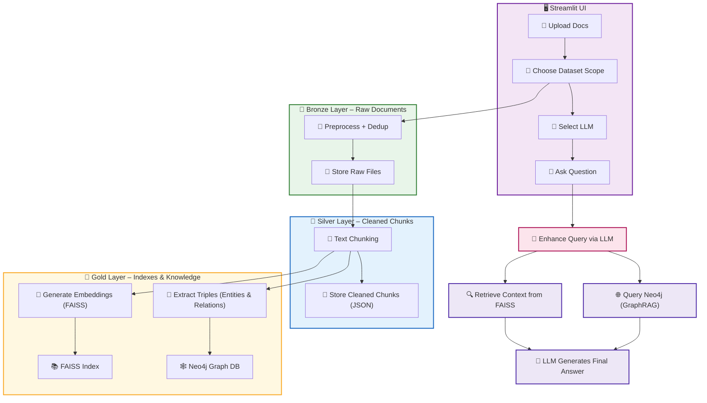

# VaultFlex 
**Chat with your Knowledge** using a hybrid RAG pipeline (Vector + Graph). Built for teams that want full control over their data.

## 🚀 Features

- 📁 **Flexible Knowledge Base Scopes** — create isolated workspaces per domain or project
- 🧠 **Hybrid Retrieval** — combines vector search (FAISS) and knowledge graphs (Neo4j)
- 🔍 **LLM-Augmented Reasoning** — responds only from your ingested content (no hallucinations)
- 🧾 **Document Parsing** — PDF, DOCX, Markdown, TXT support
- 🪄 **Interactive UI** — powered by Streamlit, clean and customisable
- 💾 **Medallion Data Architecture** — Bronze → Silver → Gold data layers

### 📁 Medallion Data Architecture

VaultFlex follows a structured Medallion data pipeline to process documents:

* 🥉 **Bronze**: Raw files uploaded by the user are stored.
* 🥈 **Silver**: Cleaned, chunked, and standardised text representations (JSON).
* 🥇 **Gold**: Semantic embeddings stored in FAISS, and knowledge graphs built in Neo4j.

```
VaultFlex/
├── data/
│   └── <dataset_name>/
│       ├── bronze/       # Raw documents (PDF, DOCX, etc.)
│       ├── silver/       # Chunked and cleaned JSON text
│       └── gold/         # FAISS vector store (and in Neo4j)
```

---

### 🛡️ Smart Upload: Hash-Based Deduplication

VaultFlex automatically prevents duplicate document ingestion:

* ✅ On upload, each file is hashed (e.g., SHA256).
* 🚫 If the same file (even renamed) was previously uploaded, it's rejected.
* 💾 This ensures clean, efficient, and consistent data processing.

Hashes are tracked in a persistent file: `HASH_TRACK_FILE`, with scope-aware keys like `finance/employee_policy.pdf`.


## 🧪 Technologies

- `Streamlit` — UI
- `FAISS` + `HuggingFace` — Embedding & vector storage
- `Neo4j` — Knowledge graph backend
- `LangChain` — Document parsing and chunking
- `Ollama` / `LLM API` — Model communication

---

## 📦 Project Structure

```
VaultFlex/
├── data/                    # All datasets (Bronze/Silver/Gold)
│   ├── bronze/             # Raw uploaded documents per KB
│   ├── silver/             # Chunked documents as JSON
│   ├── gold/               # FAISS vector indexes
│   └── ingested_hashes.json
├── doc/                    # Docs and branding
│   └── images/vaultFlex_logo.png
├── src/
│   ├── ui/                 # Streamlit UI modules
│   ├── vector/             # Embedding, graph builder, retriever
│   ├── utils/              # Utility tools (e.g. service checks)
│   ├── config.py           # Centralised paths and settings
│   └── __version__.py
├── main.py                 # App entry point
├── environment.yml         # Conda environment setup
├── requirements.txt        # Pip requirements
└── README.md               # You're reading it

```
### 🔁 Pipeline Workflow



---

## 🧠 LLM Usage

VaultFlex calls your selected local LLM to:
- Refine vague user questions
- Synthesise answers from graph triples and chunks
- Avoid hallucination by grounding output in source data

Supports: `deepseek-r1`, `gemma3`, or anything via `Ollama`.

---

## 🏁 Quickstart

```bash
# 1. Start backend (Ollama and neo4j)
# 2. Install dependencies
pip install -r requirements.txt

# 3. Update .env (see env_template)
update .env

# 4. Launch the UI
streamlit run app.py
```

---

## 💬 Example Use

- Upload multiple PDFs and DOCXs into `Finance` knowledge base
- Ask: *"what were the key themes discussed in quarterly reports?"*
- VaultFlex retrieves vector data, queries the graph, and answers using both


---

🤝 Made with ❤️ by Anish Khadka - VaultFlex
